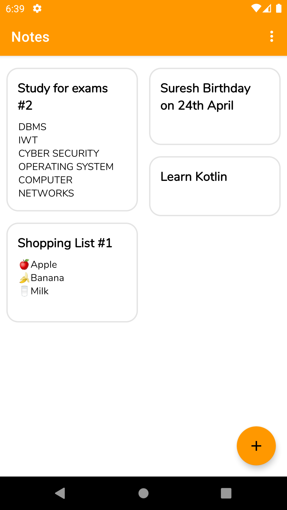
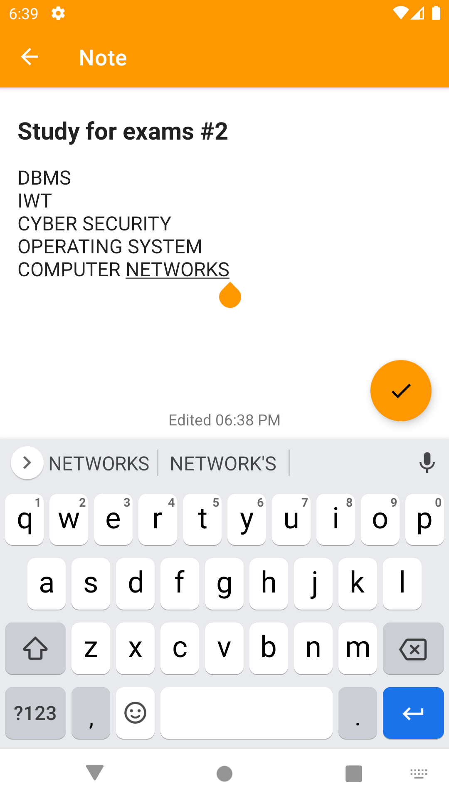
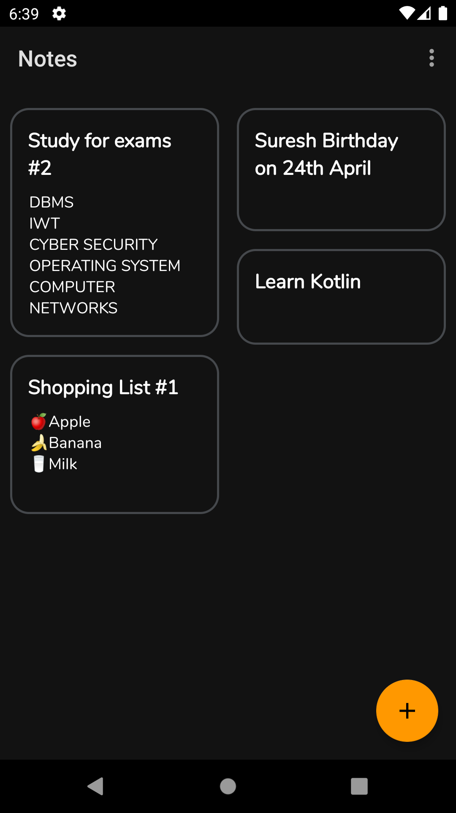

# Android Study Jams 2021

KeepNotes Kotlin App

### Problem Statement:

As a student, you take a lot of notes. Managing those notes can become very difficult if one is not careful and very organized. Technology plays a vital role in day-to-day life activities which in turn made great changes in many work fields and out of them Mobile Application is one of the major developments. Mobile Application can be used effectively for this job as they are widely used and are known for easy access.

### Proposed Solution :

Our main objective was to provide students with all the tools they need to take dynamic notes without over complicating the app with unnecessary features.
We want to allow the students to focus their time and attention to absorbing content from lectures and not on overcoming cumbersome app impairments.
So we Created an offline mobile application that makes this process easy.
Every notes is automatically organized into sections which contain pages — letting you decide visually how you want to arrange your notes. Keep one section for your song writing, another one for recipes, or start jotting down plans for your next vacation or the new school year. Notes makes it easy to keep tabs on everything in your life.

### 🖼 Screenshots

<table style="width:100%">
  <tr>
    <th>Home</th>
    <th>Add/Edit Notes page</th>
    <th>Dark Theme</th>
  </tr>
  <tr>
    <td></td> 
    <td></td>
    <td>
  </tr>
</table>

### Functionality & Concepts used :
1. Room Persistence Library - To store Notes created By the User.
2. Navigation component - To move between different fragments in-app. 
3. Data Binding - To access the views directly and The accessing of view reduced the overhead and the app performance
increased drastically.
4. Recycler View - To Display the notes stored By the user
5. Coroutines - To  perform database related operations asynchronously (Database Operation Include insert/delete/deleteAll/update/retrieve ALl)
6. Material Design Library - Used throughout the app to maintain Consistency with Android Design Guideline 
7. Dark Mode (Night Mode) - Saves Battery and Reduces strain on eyes.
8. LiveData & Room Database : We are also using LiveData and Room Database.

### Application Link & Future Scope :

